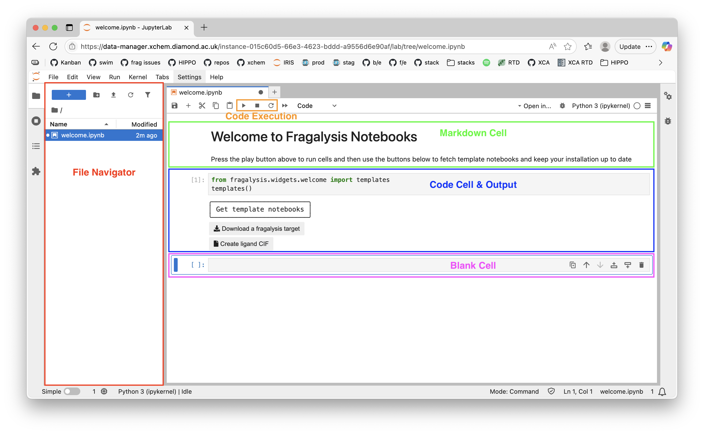

# Part A1: Jupyter Notebooks on Fragalysis

### [[Back to intro]](README.md) [[Next section]](A2_GIT_AND_TERMINAL.md)

Jupyter notebooks are a convenient way to run Python scripts from a user-friendly web interface. Fragalysis offers pre-configured notebooks apps via the Squonk Data Manager, that include the FFF tools described in this workshop and are the recommended way to run small FFF calculations.

## Accessing notebooks on Fragalysis

Follow the [Fragalysis instructions](https://fragalysis.readthedocs.io/en/latest/notebooks.html) to get yourself a JupyterLab instance.

## Notebook intro

<picture>
 
</picture>

- The _File Navigator_ (red in the above image) provides an interface to create, rename and delete files and directories in the Squonk project. You can also right click to download files, and drag and drop from your Windows file browser / Mac Finder window to upload files.
- Jupyter Notebooks have _Cells_ which can store
 - _Markdown_ formatted text (green)
 - Python _Code_ (blue)

## Python cells

To execute a python cell use the _Code Execution_ buttons in the toolbar (orange):

- Play button to execute a cell (`SHIFT-ENTER` achieves the same thing)
- Stop button to stop cell execution

The output of the last line of code will automatically be displayed using the `display` function unless the line ends with `;`

If you need help with basic Python I recommend [W3Schools](https://www.w3schools.com/python/python_intro.asp)

## Welcome and Template Notebooks

When you first start a Squonk Jupyter Notebook app with the `FFF Tools` container image you will automatically have FFF software installed, and be presented with the `welcome.ipynb` notebook. 

Execute the first code cell to create a widget interface to get more template notebooks. If you wish to contribute to the available notebooks see the [xchem/squonk-fragalysis-notebooks](https://github.com/xchem/squonk-fragalysis-notebooks) repository

## Downloading a Fragalysis target

For the purpose of this workshop, you can use the `download.ipynb` notebook template to download the `A71EV2A` target from production Fragalysis, and/or another target of your choice.

## FAQ

### How do I stop a runaway process?

Restart the _Python Kernel_ with the reload button in the _Code Execution_ buttons in the toolbar

### How do I execute terminal commands?

Start a line of code with `!` to execute command-line commands, such as `!ls` to list the contents of the current working directory or create a `Terminal` tab by clicking on the blue plus icon at the top of the _File Navigator_.

### How do I dynamically load imported python modules?

If you are developing python modules that are imported in a cell, use the `autoreload` extension to automatically load source code changes:

```
%load_ext autoreload
%autoreload 2
import hippo
```

Many other such extension commands exist

## Other Resources

- [Official Jupyter documentation](https://docs.jupyter.org/en/latest/)
- [Dataquest Jupyter notebook tutorial](https://www.dataquest.io/blog/jupyter-notebook-tutorial/)

### [[Back to intro]](README.md) [[Next section]](A2_GIT_AND_TERMINAL.md)
