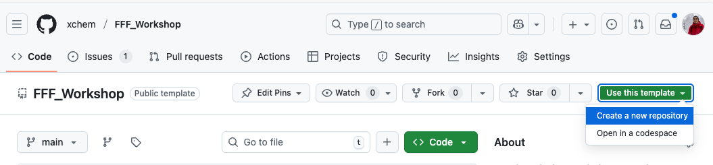
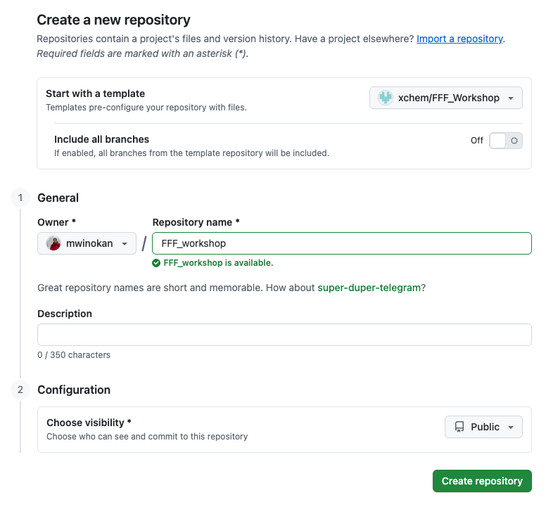

# Part A2: Using git(hub) and the terminal

### [[Previous section]](A1_NOTEBOOKS.md) [[Next section]](A3_FFF_TEMPLATE.md)

Git is the most common way to track changes in software projects. Github.com is the most popular place to store such *repositories* (for free) and they are a great way of backing up your code and (<100Mb) output files. Some knowledge of the command-line is required and basics are covered here.

## Creating a github repo for your FFF project

To get yourself a personal copy of the workshop materials, and get a workspace to keep your work in use the https://github.com/xchem/FFF_Workshop as a *template* for a new repository:

<picture>
 
</picture>

<picture>
 
</picture>

<!-- Create a new *repository* on Github.com: https://github.com/new. E.g. for this workshop you could set up -->

Max will run you through some basic git & command line tasks, covering:

- Changing working directories
- Cloning a repo
- Pushing changes

## FAQ

### How do I set up to develop FFF tools?

- Clone repos
- Pip install as editable
- Autoreload jupyter extension
- Commit and push changes

## Other Resources

### [[Previous section]](A1_NOTEBOOKS.md) [[Next section]](A3_FFF_TEMPLATE.md)
