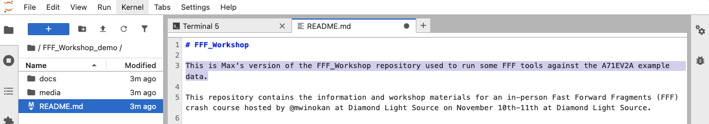

# Part A2: Using git(hub) and the terminal

### [[Previous section]](A1_NOTEBOOKS.md) [[Next section]](A3_FFF_TEMPLATE.md)

Git is the most common way to track changes in software projects. Github.com is the most popular place to store such *repositories* (for free) and they are a great way of backing up your code and (<100Mb) output files. Some knowledge of the command-line is required and basics are covered here.

## Creating a github repo for your FFF project

To get yourself a personal copy of the workshop materials, and get a workspace to keep your work in use the https://github.com/xchem/FFF_Workshop as a *template* for a new repository:

<picture>
 
</picture>

You can give it any name you like, and if you plan to work on a private target it's best to make the repository private as well:

<picture>
 
</picture>

## Cloning the repository in your notebook workspace

In a terminal window of your Fragalysis JupyterLab instance clone your new repository, replacing `YOUR_USER_NAME` with your Github username:

```
git clone https://github.com/YOUR_USER_NAME/FFF_Workshop.git
```

This will create the directory named after your repository and download the latest files.

## Making and committing changes to files

Git is a version control software that allows you to keep track of text files such as documentation, scripts, and source code over time.

To demonstrate how it works, open the README.md file in your downloaded repository via the Jupyter file navigator. Then you can add a line describing what you plan to do in this repository:

<picture>
 
</picture>

Now your local copy of the README.md file will differ from the latest *committed* version. You can see the difference by typing `git diff` in the terminal:

```
diff --git a/README.md b/README.md
index 87caead..35b740d 100644
--- a/README.md
+++ b/README.md
@@ -1,5 +1,7 @@
 # FFF_Workshop
 
+This is Max's version of the FFF_Workshop repository used to run some FFF tools against the A71EV2A example data.
+
 This repository contains the information and workshop materials for an in-person Fast Forward Fragments (FFF) crash course hosted by @mwinokan at Diamond Light Source on November 10th-11th at Diamond Light Source.
```

To store this version in the git history you will need to add and then commit the file:

```
git add README.md
git commit -m 'Update README'
```

`'Update README'` is the *commit message*. It is best practice to mark the changes with a useful commit message.

## Pushing your changes to Github

In theory, pushing your changes to Github is as simple as running `git push`. However, some setup is likely required if this is your first time.

### First time setup

1. Generate a personal access token on github.com: https://github.com/settings/personal-access-tokens/new
2. In the jupyter terminal run: `git config --global credential.helper store`
3. Then run `git push`, using your github account name as the username, and the **token as your password** when prompted.

Then you can verify on github.com that the README.md has been updated

## FAQ

### How do I set up to develop FFF tools?

The FFF Jupyter image already comes with FFF tools but if you want to work on the source code you will need to install an editable copy.

E.g. for HIPPO:

- Fork the repository on github
- Clone the repository: `git clone https://github.com/YOUR_USERNAME/HIPPO`
- Pip install an editable copy `pip install --user --no-deps -e .`

## Other Resources

- [w3schools Git Tutorial](https://www.w3schools.com/git/git_getstarted.asp)

### [[Previous section]](A1_NOTEBOOKS.md) [[Next section]](A3_FFF_TEMPLATE.md)
